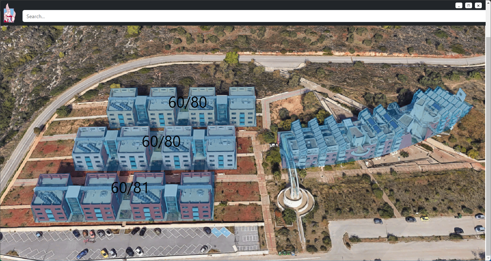

# TUChome App

## Overview

The **TUChome App** is a portable Windows application designed to assist with the management of the "Hall of Residencies" at the Technical University of Crete (TUC). The application provides a neat graphical user interface (GUI) to visualize occupancy, track breakdowns, and manage information about occupants and available rooms.

## Features

### Occupancy Visualization

- **Real-time occupancy status**: View the current occupancy status of the hall, including the number of occupied and available rooms.
- **Detailed room information**: Click on individual rooms to see detailed information about each occupant and room status.

### Occupant Information

- **Store occupant details**: Keep track of occupant information, including name, contact details, and room assignment.
- **Search and filter**: Quickly find occupants using search and filter options.

### Room Availability

- **View available rooms**: See a list of all available rooms at a glance.

## Usage

1. **Launch the application**: Double-click the `tuchome.exe` file to open the application.
2. **Upload the xlsx**: Upload the `TUCres.xlsx` file found in `misc` folder, in order to update the status of the occupants and rooms.
3. **Room Availability**: Visit the Rooms section to view available rooms and assign new occupants.
